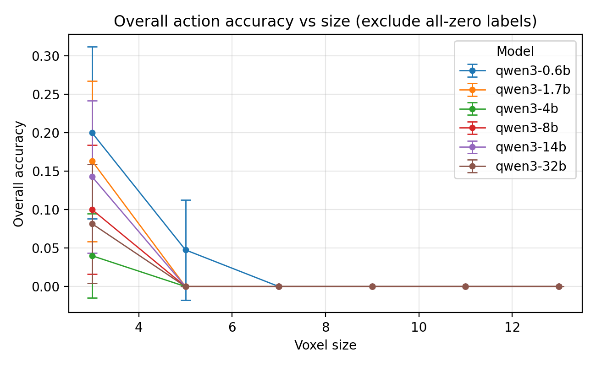
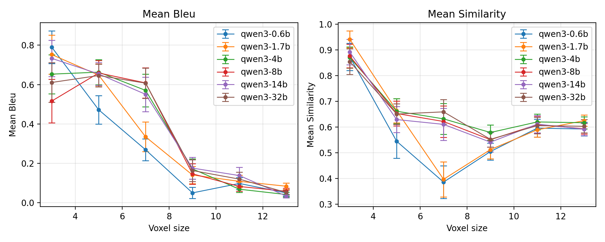
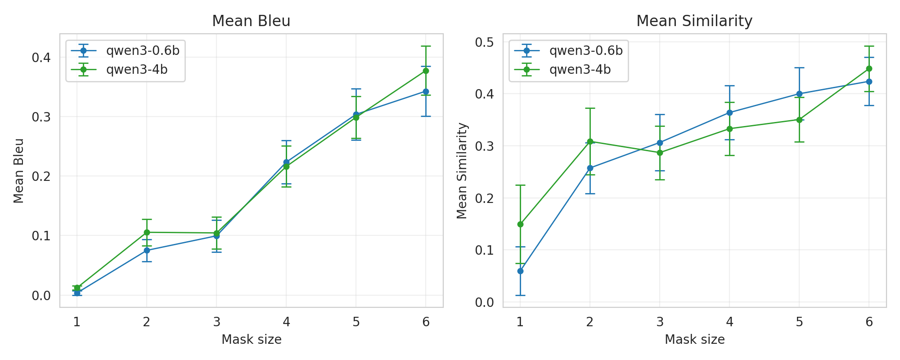

# Minecraft Voxel LLM Experiments

## 1. Overview

This report summarises experiments on two sequential reasoning tasks defined over Minecraft voxel grids using the Qwen3 model family. 
We evaluate how performance scales with:
- **Voxel size** for *frame reconstruction* and *action recognition*.
- **Mask size** for a *masked frame reconstruction* variant.

Unless otherwise noted, evaluations are zero-shot / in-context (no task-specific training) and use cached results from the public repository 
`yhbcode000/nlp701-final-project`.

## 2. Dataset and Tasks

### 2.1 Minecraft voxel dataset

Episodes are MineDojo-style Minecraft recordings stored as `.npy` frame dumps under `datasets/minecraft/data/creative:{episode}`. 
The loader constructs paired samples:
- Current frame: **x**
- Next frame: **z**
- Action between frames: **y**
- History strings: alternating frame–action descriptions

A fixed set of test indices (`INFERENCE_TEST_INDICES`) is used for all official evaluations.

### 2.2 Tasks

**D1 — Frame reconstruction**  
Given a history string `h` ending at time *t*, the model predicts the next frame \(\hat{z}\) in a pipe-delimited voxel grid format. 
Targets: `pair["z"]` and `pair["history_reconstruction"]`.

**D2 — Action recognition**  
Given a history string of frame–frame–action triplets up to time *t+1*, the model predicts an action block describing three decisions:
- **Straight**
- **Pan**
- **Jump**  

Targets: `pair["y"]` and `pair["history_action"]`.

**D3 — Masked frame reconstruction**  
Given a frame where a contiguous spatial mask has been removed, the model predicts the missing content. 
We sweep over different **mask sizes** to measure how context size affects reconstruction quality.

## 3. Models

All models are variants of **Qwen3** loaded via a common `ModelWrapper`:
- qwen3-0.6b
- qwen3-1.7b
- qwen3-4b
- qwen3-8b
- qwen3-14b
- qwen3-32b

The wrapper handles prompt construction, generation, and metric computation. 
(Some experiments – especially mask reconstruction – use only the 0.6B and 4B models.)

## 4. Experimental Setup

### 4.1 Voxel-based experiments

For frame reconstruction and action recognition we sweep **voxel sizes**:

\[ \text{Voxel size} \in \{3, 4, 5, 7, 9, 11, 13\}. \]

For each size and model we evaluate on the fixed test set and compute:
- **BLEU** between predicted and ground-truth frames (D1).
- **Word embedding similarity** between predictions and labels (D1).
- **Per-dimension action accuracy** and **overall exact-match accuracy** (D2).

### 4.2 Mask-based reconstruction

For masked frame reconstruction we vary the **mask side length**:

\[ \text{Mask size} \in \{1, 2, 3, 4, 5, 6\}. \]

Metrics mirror D1:
- Mean **BLEU**
- Mean **similarity** (embedding-based)

## 5. Results

### 5.1 Action recognition vs voxel size

*Figure 1: Overall action recognition accuracy (excluding all-zero labels) across voxel sizes for the Qwen3 family. 
Error bars show standard errors across test episodes.*

Key observations:

- Accuracy is highest at the **smallest voxel size (3)** and rapidly degrades as voxel size increases.
- For voxel sizes **≥ 7**, all models effectively collapse to near-zero overall accuracy on this metric.
- The smallest model (qwen3-0.6b) maintains non-zero accuracy slightly longer (up to size 5), but absolute performance remains low overall.

#### 5.1.1 Per-model averages (action recognition)

Averaged across all voxel sizes:

|      Model | Avg Straight | Δ Straight | Avg Pan | Δ Pan | Avg Jump | Δ Jump | Avg (overall) | Δ Avg | N sizes |
| ---------: | -----------: | ---------: | ------: | ----: | -------: | -----: | ------------: | ----: | ------: |
| qwen3-0.6b |         0.64 |       0.00 |    0.65 |  0.00 |     0.75 |   0.00 |          0.68 |  0.00 |       6 |
| qwen3-1.7b |         0.64 |      -0.00 |    0.61 | -0.04 |     0.79 |  +0.04 |          0.68 | -0.00 |       6 |
|   qwen3-4b |         0.60 |      -0.05 |    0.59 | -0.06 |     0.78 |  +0.02 |          0.65 | -0.03 |       6 |
|   qwen3-8b |         0.63 |      -0.02 |    0.59 | -0.06 |     0.80 |  +0.05 |          0.67 | -0.01 |       6 |
|  qwen3-14b |         0.66 |      +0.01 |    0.62 | -0.03 |     0.79 |  +0.04 |          0.69 | +0.01 |       6 |
|  qwen3-32b |         0.60 |      -0.04 |    0.60 | -0.05 |     0.76 |  +0.01 |          0.66 | -0.03 |       6 |

Notes:

- Differences between models are relatively small when averaged over sizes.
- The **14B** model is slightly best overall (+0.01 over 0.6B).
- Larger models do **not** consistently dominate, suggesting that prompt formulation and voxelisation may be more limiting than raw model capacity.

### 5.2 Frame reconstruction vs voxel size

*Figure 2: Frame reconstruction performance vs voxel size. Left: mean BLEU. Right: mean embedding-based similarity.*

#### 5.2.1 Per-model averages (frame reconstruction)

|      Model | Avg BLEU | Δ BLEU | Avg Similarity | Δ Sim | N sizes |
| ---------: | -------: | -----: | -------------: | ----: | ------: |
| qwen3-0.6b |     0.29 |   0.00 |           0.58 |  0.00 |       6 |
| qwen3-1.7b |     0.34 |  +0.06 |           0.62 | +0.04 |       6 |
|   qwen3-4b |     0.36 |  +0.07 |           0.66 | +0.08 |       6 |
|   qwen3-8b |     0.35 |  +0.06 |           0.65 | +0.07 |       6 |
|  qwen3-14b |     0.38 |  +0.09 |           0.65 | +0.06 |       6 |
|  qwen3-32b |     0.37 |  +0.08 |           0.65 | +0.07 |       6 |

Trends:

- BLEU and similarity **decrease sharply** with increasing voxel size; very large voxels (≥ 11) are extremely challenging.
- Averaged over sizes, **all larger models outperform the 0.6B baseline** by 0.06–0.09 BLEU and 0.04–0.08 similarity.
- Gains saturate beyond ~14B; qwen3-14b and qwen3-32b provide only modest improvements over 4B/8B.

### 5.3 Masked frame reconstruction vs mask size

*Figure 3: Masked frame reconstruction performance vs mask size for qwen3-0.6b and qwen3-4b. Left: mean BLEU. Right: mean similarity.*

As the spatial mask grows, the model must reconstruct increasingly large missing regions from surrounding context.

#### 5.3.1 Per-model averages (masked reconstruction)

|      Model | Avg BLEU | Δ BLEU | Avg Similarity | Δ Sim | N masks |
| ---------: | -------: | -----: | -------------: | ----: | ------: |
| qwen3-0.6b |     0.17 |   0.00 |           0.30 |  0.00 |       6 |
|   qwen3-4b |     0.20 |  +0.02 |           0.35 | +0.04 |       6 |

Observations:

- Performance **improves with mask size** up to ~5–6, suggesting that larger masks encourage more coherent, global completions instead of local noise.
- The **4B model** consistently outperforms 0.6B in both BLEU and similarity, indicating that additional capacity helps the model leverage surrounding context for inpainting-style tasks.

## 6. Discussion

1. **Voxel size matters more than model size.**  
   Both action recognition and frame reconstruction degrade sharply as voxel size increases. Granular voxelisations (size 3–4) preserve enough structure for the models to reason about motion and geometry; coarse voxelisations discard crucial detail.

2. **Model scaling provides moderate but consistent gains.**  
   Larger Qwen3 variants systematically improve frame reconstruction metrics and slightly improve action recognition when averaged over sizes. However, the gains are small compared to the loss from aggressive downsampling.

3. **Masked reconstruction benefits from capacity.**  
   For inpainting-style tasks, qwen3-4b yields clear improvements over 0.6B across all mask sizes, especially in embedding similarity. This indicates that larger models better exploit context to reconstruct plausible voxel patterns.

4. **Prompt and representation design remain key bottlenecks.**  
   The collapse of action accuracy for large voxels, and the limited spread between model sizes, suggest that better textual encodings of voxel grids and histories could yield larger improvements than further model scaling alone.
